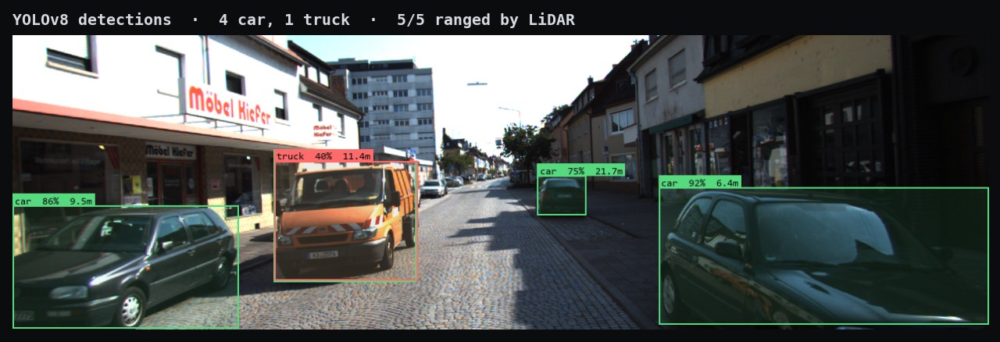
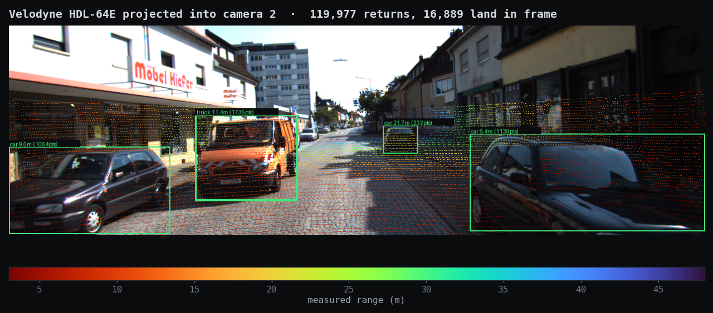
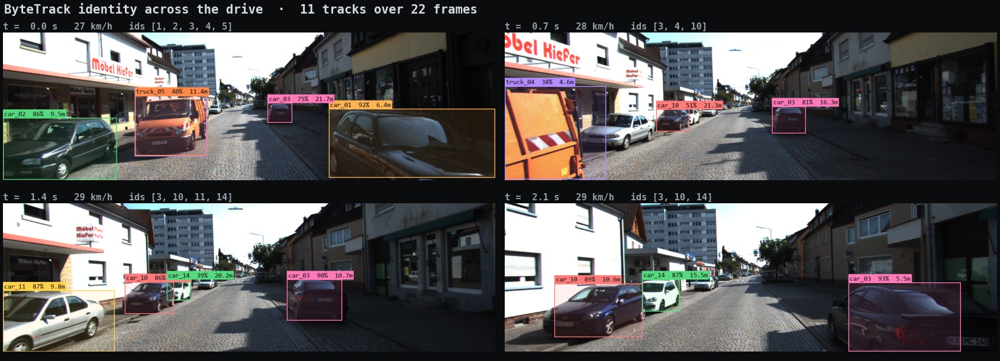
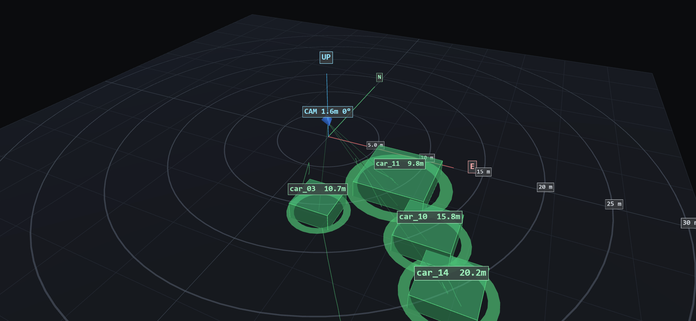
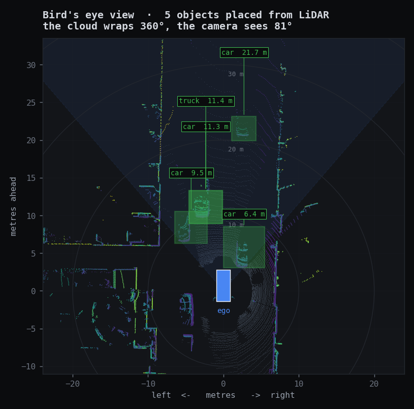
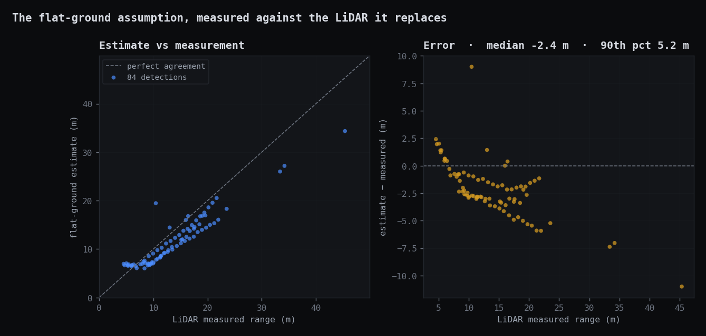
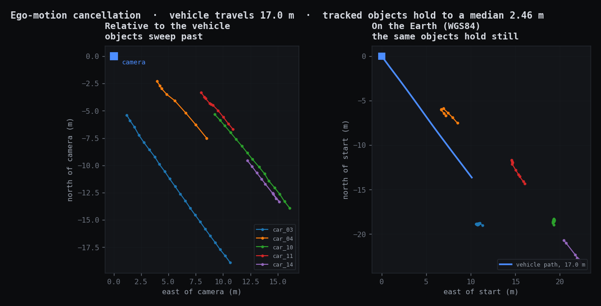

# GeoDetect — Visual Intelligence Platform

Upload an image or a video, detect everyday objects, estimate where each one
actually is in the world, and then *interrogate the scene in plain language*.



*Real KITTI frame. Every box carries a class, a confidence and a distance —
and the distance came off the Velodyne, not out of the network.*

```
  camera image ──▶ YOLO detection ──┐
                                    ├──▶ world coordinates ──┐
  LiDAR + GPS/IMU + calibration ────┘    MEASURED or          │
                                          estimated           │
                            ┌─────────────────────────────────┤
                            ▼                 ▼               ▼
                        GIS map          3D world view   scene graph
                      (Leaflet, WGS84)  (Three.js, ENU)  (spatial relations)
                                                              │
                                                              ▼
                                                Geo Intelligence Assistant
                                                  (LLM over measurements)
```

With a **real KITTI drive** loaded, the positions are not inferred at all: the
Velodyne LiDAR supplies true depth, the OXTS GPS/IMU supplies the vehicle's
pose, and the rig's calibration files tie them to the camera. With an ordinary
photo or video, the same pipeline falls back to projecting onto an assumed flat
ground plane -- and says so, everywhere it matters.

The point is not object detection. The point is what you can do once detections
have **coordinates and relationships**: ask *"show me all people within 25 metres
of the bus"* and watch the answer light up simultaneously on the image, the map,
the 3D scene and the object table.

Everything runs locally except the language model. The backend is FastAPI, the
frontend is plain ES modules with no build step, and the detector is a pretrained
YOLOv8 — nothing is trained here.

---

## What it does

| Stage | What happens |
|---|---|
| **Source** | A real KITTI drive (camera + LiDAR + GPS/IMU), or your own image or video. EXIF and DJI XMP metadata auto-fill the camera panel when present. |
| **Detect** | Pretrained YOLOv8 over the 80 COCO classes — people, cars, buses, bicycles, dogs, chairs, backpacks, bottles, traffic lights and the rest. Video adds ByteTrack, giving each object a persistent id (`person_01`, `car_02`). |
| **Geometry** | **With LiDAR:** the returns that land inside each box give true depth. **Without:** the box's ground contact point is back-projected and intersected with an assumed ground plane. |
| **World** | Local ENU metres and WGS84 lat/lon, plus real-world size, distance and bearing. Every position is tagged `measured` or `estimated`. |
| **Reason** | A spatial scene graph, and an LLM assistant that queries and controls it. |

### Real sensor data (KITTI)

Load the bundled KITTI drive and nothing about the camera is guessed:

| What | Where it comes from |
|---|---|
| Intrinsics (focal length, principal point) | `calib_cam_to_cam.txt` -> `P_rect_02` |
| LiDAR -> camera transform | `calib_velo_to_cam.txt` |
| IMU -> LiDAR transform | `calib_imu_to_velo.txt` |
| Vehicle position and orientation | OXTS RT3003 GPS/IMU, per frame |
| **Object depth** | **Velodyne HDL-64E, ~120k returns per frame** |
| Camera height above the road | Measured from the LiDAR ground plane |

Each detection's position is found by projecting the point cloud into the image,
keeping the returns that land inside the box, separating the object from the
background behind it, and rotating the result into world coordinates with the
GPS/IMU orientation. Objects with too few returns fall back to the ground-plane
estimate and are labelled differently -- in the table, in the 3D scene, and on
the honesty tag above every view.

The camera panel goes read-only while a drive is loaded, and shows the live
sensor readings instead: position, heading, speed, camera height and LiDAR
return count, updating as the vehicle moves.

**Does it actually work?** The drive is a street of parked cars filmed from a
vehicle doing 27 km/h. Over 22 frames the vehicle covers 17 m, and a parked
car's *ego-relative* position sweeps 16.5 m past it -- while its *absolute*
WGS84 position stays put to within 0.7 m. Ego motion cancelling that precisely
means the calibration, the LiDAR projection, the IMU rotation and the yaw
convention are all correct together. That check is
[`test_parked_cars_stay_put_while_the_vehicle_drives_past`](backend/tests/test_kitti.py).

### What it produces

All of these come straight out of the pipeline on the bundled KITTI drive.
`python tools/make_figures.py` regenerates every one of them, so they cannot
drift away from what the code actually does.

**LiDAR projected into the camera frame** — the check that the calibration is
right. Returns hug the cars and the kerb, stop dead at the sky, and thin out
with distance. Colour is measured range.



**Tracking** — ByteTrack keeps each object's identity as the vehicle drives.
`car_03` is the same car at 21.7 m, 16.3 m, 10.7 m and 5.5 m; the colour is
keyed to the track id, not the class.



**The 3D world view**, captured from the running app: ground grid, distance
rings, camera frustum, a ray from the camera to each object, and solids sized
from the measured extents.



**Bird's eye view** — the LiDAR wraps a full 360°, the camera sees 81° of it,
and the detections sit where the fusion put them.



---

### Does the geometry actually work?

Two figures, both generated from the data rather than asserted in prose.

**What the flat-ground assumption costs.** Both numbers below come from the
same detection box: one reads the range off the LiDAR, the other assumes the
object stands on a flat plane at a known camera height. The estimate holds up
close and degrades with distance, which is exactly the failure mode you would
predict — small angular errors near the horizon become large range errors.
Median error −2.4 m, 90th percentile 5.2 m. This is why the UI labels the two
paths differently instead of quietly averaging them.



**Ego-motion cancellation** — the end-to-end check, and the one that would
catch a consistent error anywhere in the chain. Left: relative to the camera,
every parked car sweeps past in a long straight line. Right: on the Earth, the
same cars collapse to tight clusters while the vehicle covers 17 m. If the
calibration, the LiDAR projection, the IMU rotation or the yaw convention were
wrong, the right-hand panel would smear as badly as the left.



The residual spread — a median 2.46 m — is not fusion error. A LiDAR only sees
the faces pointing at it, so the centroid of a car's returns migrates from its
back towards its side as you drive past. That is geometry, and it sets the
floor on this measurement.

---

### The interface

Laid out the way sensor-visualisation tools are — Foxglove Studio, Rerun, RViz
— because those conventions exist for a reason when the content is imagery,
point clouds and 3D scenes:

```
 ┌──────────────────────────────────────────────────────────────┐
 │ menubar · pipeline stages · model + assistant status         │
 ├──────────┬──────────────────────────────────┬────────────────┤
 │ sources  │  detection    │  map             │  inspector     │
 │ sensors  │               ├──────────────────┤                │
 │ camera   │               │  3d              │  assistant     │
 │ inference│───────────────┴──────────────────┤                │
 │          │  object table                    │  scene graph   │
 ├──────────┴──────────────────────────────────┴────────────────┤
 │ timeline: transport + one track row per object               │
 ├──────────────────────────────────────────────────────────────┤
 │ status bar: obj · cls · conf · infer · fps · near · far · pos │
 └──────────────────────────────────────────────────────────────┘
```

The specifics, and why each one:

- **Near-black, flat, square.** One-pixel borders do all the separating; no
  shadows, gradients or blur. Depth cues are reserved for the 3D view, where
  they carry meaning. Colour encodes a class or a state and nothing else.
- **A source tree, not a form.** Datasets and the sensors each one provides,
  with type icons — the KITTI drive lists its camera, Velodyne and OXTS
  because it genuinely has all three.
- **Every pane has a title bar** with its own name, coordinate frame and
  actions, so a region reads as a component rather than a div.
- **An inspector** on the right showing the full property list of whatever is
  selected, including LiDAR depth and return count when the position was
  measured.
- **A global timeline** across the bottom, with one row per tracked object
  showing exactly when it was visible and a tick per observation. This is the
  view that answers a question none of the panes can: a track that spans the
  whole drive is a real object, one that flickers for two frames is probably
  not. Scrubbing it moves every pane at once.
- **A status bar** of live figures, so the numbers you check constantly never
  cost a click.
- **Monospace for every number**, so columns align and digits stop shifting as
  values change.

Selecting an object anywhere — image, map, 3D, table or timeline — selects it
everywhere, and fills the inspector.

Panels resize by dragging the splitters (double-click resets, sizes persist).
`1`–`4` switch the viewport between detection, map, 3D and all four; `F` is
full screen; `Space` plays; `Esc` clears the selection.

### Geo Intelligence Assistant

The assistant **never sees the image**. It receives the structured scene graph —
classes, confidences, distances, bearings, coordinates, and spatial relations —
and translates questions into operations over that data:

```json
{
  "summary": { "object_count": 5, "nearest": { "label": "Person #1", "distance_m": 2.2 } },
  "objects": [
    { "id": 0, "label": "Bus #1", "class": "bus", "confidence": 0.87,
      "distance_m": 3.2, "side": "ahead", "latitude": 47.376925, "longitude": 8.541722,
      "relations": [{ "kind": "near", "target": "Person #3" }] }
  ]
}
```

Things it handles:

- *"How many people are visible?"* — answered from the data, no tool call.
- *"Which object is closest to the camera?"* — reads the measurement.
- *"Show only vehicles."* / *"Highlight all cars."* — calls `select_objects`,
  the views filter and highlight.
- *"Show me all people within 25 metres of the bus."* — becomes
  `select_objects(classes=["person"], near_object_id=<bus>, near_radius_m=25)`,
  a real spatial query the backend runs.
- *"Which objects are within 30 metres?"*, *"What is on the left side?"*,
  *"Are there any people near vehicles?"*, *"Summarize this scene."*

Its tool calls are shown, not hidden — you can see exactly which query produced
the highlight. Without an API key the panel still handles counts, nearest and
farthest, and category filters, and says plainly that it is running without the
model.

### Scene graph

Relationships derived from the estimated positions, computed from the camera's
point of view:

```
Person #1
├─ 2.2 m from camera
├─ left of centre (26°)
├─ near Person #3 (0.5 m apart)
└─ left of Bus #1
```

Left/right come from each object's bearing minus the camera heading. Near/far is
*scene-relative* — two metres apart is touching from a drone at 80 m and a whole
car length in a room — so the proximity radius scales with the median object
distance. Groups come from single-linkage clustering on ground positions.

### Analytics, filters and export

Live metrics: object count, class count, average confidence, inference time,
FPS, nearest and farthest object, visible ground area, and track count in video
mode. Export as **GeoJSON** (QGIS/ArcGIS, with tracks as LineStrings),
**JSON** (full record including the scene graph), **CSV**, or an annotated
**PNG screenshot**. Exports respect the active filter, so you get what you see.

---

## Running it

Requires Python 3.9+.

```bash
pip install -r backend/requirements.txt
```

```bash
python run.py
```

Open <http://127.0.0.1:8000>. Interactive API docs at `/docs`.

The first start downloads the YOLOv8-nano weights (~6 MB) into `models/`.

### The language assistant

The assistant reads its key from the `OPENAI_API_KEY` environment variable. It
is never stored in this repository.

```bash
export OPENAI_API_KEY=sk-...        # PowerShell: $env:OPENAI_API_KEY="sk-..."
```

Override the model with `GEODETECT_LLM_MODEL` (default `gpt-5.4-mini`). The
header shows whether the assistant is live.

**What leaves the machine:** when you ask a question, the *structured scene* —
class names, confidences, distances, bearings, and the camera's latitude and
longitude — is sent to OpenAI. The image and the video are **not**. If that
matters for your imagery, leave the key unset and the panel falls back to local
lookups.

### Getting the KITTI drive

The dataset is not committed (81 MB). Fetch it with two downloads:

```bash
mkdir -p data/kitti && cd data/kitti
curl -O https://s3.eu-central-1.amazonaws.com/avg-kitti/raw_data/2011_09_26_calib.zip
curl -O https://s3.eu-central-1.amazonaws.com/avg-kitti/raw_data/2011_09_26_drive_0048/2011_09_26_drive_0048_sync.zip
unzip -q '*.zip' && rm *.zip
```

That gives `data/kitti/2011_09_26/` with the calibration files and the
`2011_09_26_drive_0048_sync` folder (22 frames of camera, LiDAR and GPS/IMU).
Any other `2011_09_26_drive_*` works too -- drop it in the same place and it
appears in the sidebar. KITTI is published under CC BY-NC-SA 3.0 for
non-commercial use.

### The synthetic demo video

Separate from the real data, for trying video mode without KITTI:

```bash
python tools/make_sample_video.py
```

It pans a virtual camera across the bundled street photograph, so the detector
sees real people and a real bus that genuinely move across the frame — which is
what makes tracking and trails worth looking at. It is a synthetic camera move
over real imagery and is labelled as such in the UI. Any H.264 MP4 of your own
works just as well.

### Tests

```bash
python backend/tests/test_geo.py && python backend/tests/test_scene.py && python backend/tests/test_kitti.py && python backend/tests/test_api.py
```

85 tests. `test_kitti` covers the real-sensor path -- calibration, LiDAR
projection, the OXTS yaw convention and the end-to-end ego-motion check -- and
skips cleanly when the dataset is not present. `test_geo` is the projection
maths, `test_scene` covers the scene
graph, spatial queries, analytics and exports, and `test_api` drives the real
model end to end. All run under `pytest` too.

---

## The interesting part: how a pixel becomes a coordinate

A camera projects 3D rays onto a 2D sensor, and that throws away depth. You
cannot recover it from a single image — unless you add an assumption. The one
used here is the **flat ground plane**: detected objects stand on the ground at
elevation 0. That makes the problem solvable, because every pixel then maps to
exactly one place.

For each detection:

1. **Undo the lens.** Focal length in pixels comes from the field of view,
   `fx = (width/2) / tan(hfov/2)`. A pixel becomes a direction in camera space.
2. **Rotate into the world.** Apply roll, pitch (tilt below horizontal) and
   heading (compass bearing) to get a direction in ENU — X east, Y north, Z up.
3. **Hit the ground.** Intersect with `z = 0`. A ray at or above the horizon
   never gets there, and the detection is honestly reported as having *no ground
   fix* rather than being given a made-up position.
4. **Convert to lat/lon.** Local tangent plane using the WGS84 radii of
   curvature at that latitude — sub-metre over the few hundred metres this works
   at, without pulling in a projection library.

Real-world **size** comes from the same geometry: width by projecting the two
bottom corners onto the ground, height by walking the top-edge ray out to the
object's known distance and reading how high it has climbed. That is why the 3D
scene has a bus genuinely larger than a pedestrian.

It is all in [`backend/app/geo.py`](backend/app/geo.py), which is written to be
read.

### Is it right?

The projection is the part that can be silently wrong — a sign flip in the
heading still produces plausible-looking markers. So
[`test_geo.py`](backend/tests/test_geo.py) pins values that can be worked out by
hand (at 45° pitch the ground range equals the altitude; heading 90 puts the
target due east), and then does a **round trip**: place a 1.8 m × 0.6 m person
20 m from a camera, project them into pixels with the forward model, and check
the pipeline recovers 1.8, 0.6 and 20. It does, to within a centimetre,
including from an oblique camera on an arbitrary bearing.

As a live check, the street preset recovers the pedestrians in the bundled
sample at 1.8–1.9 m tall. That is asserted in the API tests.

### What it does not do

Which caveats apply depends on where the position came from, which is why the
UI distinguishes the two rather than averaging over them.

**On the monocular path** (your own photo or video):

- **RGB alone gives no true depth.** Positions are projections under an
  assumption, not measurements — the tag reads *Estimated position*.
- **The ground is flat.** No terrain model. On a hillside, positions drift.
- **The camera pose is taken at face value.** Wrong altitude in, confidently
  wrong answers out. Estimates degrade sharply near the horizon, which is what
  `max_range_m` guards, and heights are clamped to a plausibility ceiling so a
  mismatched pose cannot produce a 44 m pedestrian.
- **Depth is unobservable** from one view, so 3D boxes reuse the measured width.

**On the LiDAR path** (a KITTI drive) those four go away, and different ones
apply:

- **A LiDAR sees only the faces pointing at it.** The centroid of an object's
  returns migrates across it as you drive past — a metre or two on a car. That
  is geometry, not error, and it sets the floor on the accuracy check above.
- **Returns thin out with range.** Past roughly 40 m a car may not clear the
  minimum return count, and falls back to the estimated path.
- **Glass and dark paint absorb the beam,** so some vehicles are detected by the
  camera but not ranged by the LiDAR.
- **Sensors are synchronised, not simultaneous.** KITTI's LiDAR sweeps at 10 Hz
  while the shutter is instantaneous; a fast-crossing object can be a few
  centimetres out.

**Both paths:**

- **No lens distortion modelling.** Rectified input is assumed; fisheye footage
  needs calibration first.
- **COCO classes only.** Swapping in a domain-specific checkpoint is a one-line
  change — the geometry neither knows nor cares what the detector was trained on.

---

## Architecture

```
run.py                      entry point
backend/app/
  main.py                   FastAPI routes; the pipeline is orchestrated here
  geo.py                    camera model, ray/ground intersection, WGS84   ← the maths
  detector.py               YOLOv8 wrapper (lazy load, thread-safe)
  video.py                  frame sampling, ByteTrack, motion trails
  kitti.py                  real sensors: calibration, LiDAR fusion, OXTS pose
  scene_graph.py            spatial relations, groups, the query language
  llm.py                    assistant: tools, scene control, fallback
  categories.py             class → category taxonomy
  analytics.py              dashboard metrics
  exports.py                GeoJSON / JSON / CSV writers
  exif.py                   EXIF + DJI XMP camera-pose extraction
  schemas.py                Pydantic request and response models
  config.py                 paths and limits
backend/tests/              test_geo · test_scene · test_kitti · test_api
frontend/
  index.html                layout
  css/    theme (tokens) · layout (shell) · components
  js/
    app.js                  state, wiring, the pipeline stages
    api.js                  backend calls
    overlay.js              detection view (image + video canvas)
    mapview.js              GIS view (Leaflet)
    scene3d.js              3D world (Three.js)
    panel.js                object table, filters, sorting
    timeline.js             transport + per-track stream rows
    assistant.js            the chat panel
    splitter.js             resizable layout
    palette.js              one colour + glyph per class, shared by all views
tools/make_sample_video.py  generates the demo clip
tools/make_figures.py       regenerates the README figures
```

### Why analyze and reproject are separate endpoints

Inference is slow and depends only on the pixels. Geometry is arithmetic and
depends only on the camera pose. Splitting them means dragging the altitude or
heading slider re-projects **the whole scene — or the whole tracked video — in
milliseconds**, without re-running the detector. It also makes the point the app
is making: the stages really are independent.

| Route | Purpose |
|---|---|
| `POST /api/analyze` | Image: detect + geo-reference |
| `POST /api/reproject` | Redo only the geometry with a new camera pose |
| `POST /api/video/analyze` → `GET /api/video/job/{id}` | Start and poll a tracking job |
| `POST /api/video/timeline` | Geo-reference every tracked frame |
| `POST /api/kitti/analyze` → `POST /api/kitti/timeline` | Fuse YOLO with real LiDAR + GPS/IMU |
| `POST /api/scene` | Scene graph for any set of detections |
| `POST /api/assistant` | Ask a question, get an answer plus scene actions |
| `POST /api/export/{geojson\|json\|csv}` | Export what is on screen |
| `GET /api/health` `/api/classes` `/api/categories` `/api/samples` | Status and metadata |

---

## Using it

**Camera presets** give sensible starting points:

| Preset | Altitude | Pitch | HFOV | For |
|---|---|---|---|---|
| Nadir | 80 m | 90° (straight down) | 84° | Overhead mapping frames |
| Oblique | 60 m | 45° | 78° | Angled aerial shots |
| Street | 1.55 m | 6° | 70° | Handheld, vehicle or fixed cameras |

Pitch matters most — it sets how the image maps onto the ground.

**Keyboard:** `1`–`4` views · `F` full screen · `Space` play/pause video ·
`Esc` clear selection or leave full screen · `Enter` re-run · `Ctrl`/`Shift`+click
to multi-select rows.

**Reading the overlay:** a solid box has a ground fix, a dashed one does not.
The dashed vertical line and crosshair mark the exact pixel that was
geo-referenced. On the map, the cyan polygon is the true ground footprint and the
faint wedge is the field of view.

For a bigger, more accurate detector, no code change is needed:

```bash
MODEL_WEIGHTS=yolov8s.pt python run.py
```

## Notes

- **Sample images** are `bus.jpg` and `zidane.jpg`, which ship inside the
  installed `ultralytics` package and are copied into `data/samples/`. Both are
  street-level; for aerial imagery, use your own drone photos.
- **Map tiles** come from Esri and OpenStreetMap, neither of which needs an API
  key. Carto's free tiles now watermark every tile with "API KEY REQUIRED", so
  they are deliberately not used.
- **Three.js and Leaflet** load from CDN, so the map and 3D views need a network
  connection on first load. Detection itself is entirely local.
- **Video limits:** frames are sampled to ~5 fps and capped at 300 frames /
  180 s, so a long upload cannot wedge the machine.
- Uploads are kept only for the most recent items and pruned automatically.

## Licence

The code here is yours to use. The pretrained YOLOv8 weights are distributed by
Ultralytics under AGPL-3.0 — check their terms before using this commercially.
